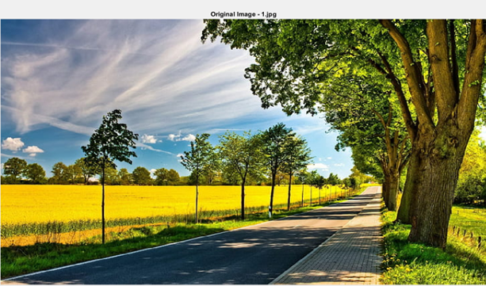

# DCT-Based Image Compression: JPEG Implementation 🚀

This repository contains a MATLAB project that implements **Discrete Cosine Transform (DCT)** for JPEG-like image compression. The project demonstrates how images can be compressed and reconstructed with varying quality levels while balancing compression efficiency and image fidelity.

## 📁 Project Structure

- **`image_compression.m`**: MATLAB code for image compression and reconstruction.
- **`DSP_Report.docx`**: Comprehensive report documenting the problem statement, theory, code, and results.
- **`images/`**: Folder containing sample input images (`1.jpg`, `2.jpg`, etc.).

## 🔧 How to Run

1. **Prerequisites**:
   - Install **MATLAB** or **GNU Octave** (a free MATLAB alternative).
2. **Setup**:
   - Place the `image_compression.m` file and the images (`1.jpg`, `2.jpg`, etc.) in the same working directory.
3. **Execution**:
   - Open MATLAB or Octave.
   - Navigate to the directory where the `.m` file is located.
   - Run the script by typing:
     ```matlab
     image_compression
     ```

## 📜 Problem Statement

Design and implement a DCT-based image compression system that follows the JPEG compression standard to reduce image sizes while maintaining acceptable image quality. The system:
- Supports various compression ratios.
- Handles multiple image formats.
- Balances compression efficiency and image fidelity.

## 📘 Report Highlights

The report covers:
- **Introduction to Image Compression**
- **Theory of DCT and Quantization**
- **MATLAB Code Explanation**
- **Results and Discussions**
- **Conclusion**

> 📂 Check the `DSP_Report.docx` file for the detailed documentation.

## 🖼️ Sample Outputs

### Original Image vs Reconstructed Image
| Original Image | Reconstructed Image (200 Quality) |
|----------------|-----------------------------------|
|  |  |


## ✨ Features

- **DCT-Based Compression**: Efficient JPEG compression using an 8x8 block-based DCT.
- **Quality Levels**: Adjustable quantization matrices for different compression levels.
- **Visualization**: Displays original and reconstructed images with compression ratios.

## 📊 Compression Details

| Image File | Quality Level | Compression Ratio |
|------------|---------------|-------------------|
| `1.jpg`    | 200           | 1.2:1            |
| `2.jpg`    | 50            | 10:1             |


